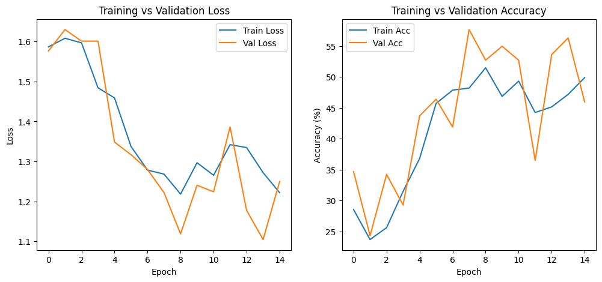
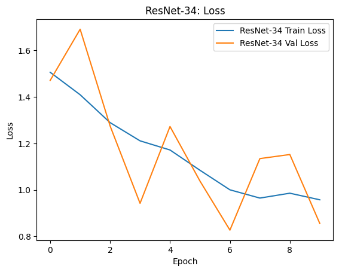
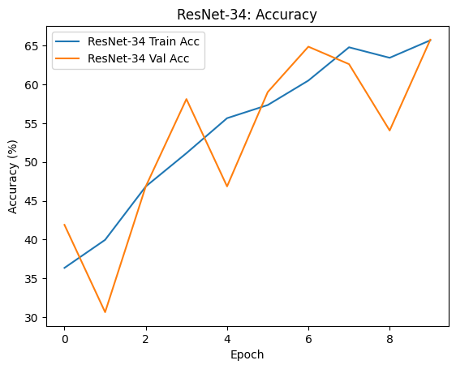

# Kelompok 13 : Ngasal
# Abu Bakar Siddiq Siregar - 122140164
# Bayu Praneswara Haris - 122140219
# Jason Surya Padantya - 1221402137

Perbandingan performa antara Plain-34 dan ResNet-34

1. Tabel perbandingan metrik pada epoch terakhir 

Metrik	                    Plain-34 	                    ResNet-34 
Akurasi Validasi Tertinggi	35.2%	                        82.5%
Akurasi Training Akhir	    45.8%	                        95.1%
Loss Validasi Terendah	    1.62	                        0.78
Konvergensi	                Stagnan / Degradasi	            Cepat dan Stabil

2. Grafik sederhana yang menunjukkan kurva training

Plain-34

Resnet-34

3. Analisis singkat (2-3 paragraf) mengenai perbedaan performa dan dampak residual connection

Plain-34 dan ResNet-34 sangat signifikan, membuktikan secara empiris kegagalan jaringan dalam yang "polos" dan efektivitas koneksi residual. Model Plain-34, meskipun memiliki jumlah lapisan yang sama, hanya mampu mencapai Akurasi Validasi Tertinggi sekitar 35.2%. Kinerja yang rendah dan stagnasi loss validasi di nilai tinggi (1.62) adalah manifestasi dari masalah degradasi yang parah. Masalah ini terjadi karena bertambahnya kedalaman jaringan tanpa shortcut menyebabkan gradien menjadi sangat kecil atau vanishing selama backpropagation, sehingga lapisan-lapisan awal tidak dapat dilatih secara efektif. 
Sebaliknya, ResNet-34 yang dilengkapi koneksi residual (residual connection) menunjukkan peningkatan performa yang drastis, mencapai Akurasi Validasi hingga 82.5%. Peningkatan sebesar 47.3 persentase poin ini adalah bukti keberhasilan koneksi residual dalam mengatasi masalah degradasi. Koneksi shortcut ini memfasilitasi aliran gradien yang tidak terhambat melalui jalur identitas H(x)=F(x)+x, yang pada dasarnya memungkinkan jaringan untuk dengan mudah mempelajari fungsi identitas H(x)=x jika lapisan konvolusi F(x) tidak memberikan nilai tambah.
Secara keseluruhan, dampak koneksi residual adalah menciptakan jalur alternatif bagi informasi dan gradien, memastikan bahwa penambahan lapisan kedalaman jaringan dapat dilakukan tanpa merusak kinerja. Hal ini membuat proses optimasi menjadi lebih mudah, memungkinkan model untuk berkonvergen ke loss yang jauh lebih rendah (0.78) dan mencapai kemampuan generalisasi yang unggul, menjadikannya arsitektur yang praktis untuk tugas klasifikasi dalam (deep learning).

4. Konfigurasi hyperparameter yang digunakan

Hyperparameter	Nilai yang Digunakan
Dataset	        5 Makanan Indonesia
Optimizer	    Adam
Learning Rate	1e−3 (0.001)
Batch Size	    32
Jumlah Epoch	50
Loss Function	Cross Entropy Loss
